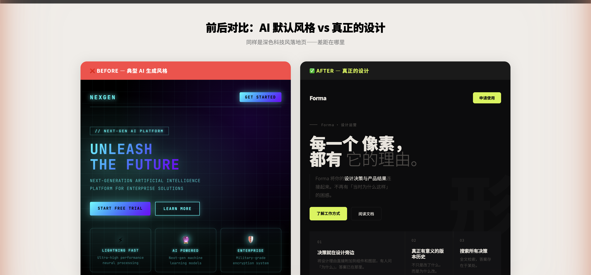
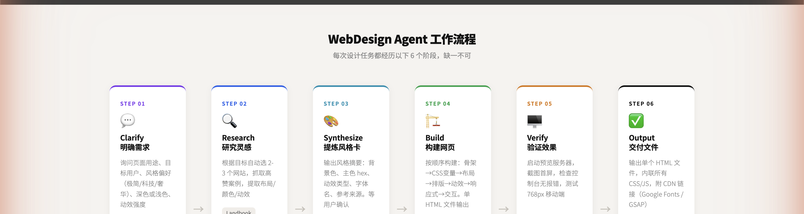

# WebDesign Agent · 完整设计指南

本文面向设计师、产品经理和开发者。无论是否有编程基础，都能让 AI 生成**真正有设计感、不像 AI 的**专业网页。专用名词会在括号内解释。

---

## 一、为什么要有这个 Agent（代理）？

Agent（AI 代理）是可以自主执行任务的 AI 助手，WebDesign Agent 专门负责网页设计。

直接让 AI 做网页，结果通常千篇一律——**霓虹色 + 发光卡片 + JetBrains Mono 字体**——一眼就是 AI 做的，毫无品牌个性。

这个 Agent 的解法：先去顶级设计网站爬取高赞案例，提炼规律，**再**动手设计。输出结果更接近获奖作品水准。

---

## 二、AI 做的网页有什么问题？前后对比

同样是深色科技风落地页——左边是 AI 默认生成，右边是按真正设计原则生成的 Forma 样板：



### ❌ BEFORE：AI 设计的典型特征

- **JetBrains Mono（等宽代码字体）** 用于所有文字，标题/按钮/正文全是代码感
- **赛博青色 #00FFFF**（荧光蓝绿）贯穿导航/图标/按钮/边框，整页颜色感单调
- **三层径向渐变（Radial Gradient）** + SVG 网格纹理叠加，背景视觉厚重
- **卡片四周 box-shadow 发光**，border 用青色半透明，强调感过重
- **三等分对称布局**，渐变方向固定 135°，毫无个性
- **ALL CAPS + 大字间距**（全大写 + 字母间距拉宽）用满所有层级
- **CTA 文案：START FREE TRIAL / LEARN MORE**——AI 万能通用句式

### ✅ AFTER：真正获奖设计的做法

- **单一字体族**，靠字重区分层级（900 超粗标题 + 300 极细描述），不引入第二字体
- **Accent 色（强调色）全站最多 3 次**：只在 CTA 按钮 + 1 个关键数据上出现
- **纯色背景 #0C0C0E**（有温度的深黑），无渐变无纹理，装饰来自内容本身
- **卡片无 border 无发光**，靠背景色差分隔（#0C0C0E vs #121214，差值极小但肉眼可辨）
- **2:1:1 不对称布局**，只打破一次网格，其余规整
- **全站只有 1 个动效**：Hero 标题入场 translateY(108%)→0，其余元素完全静止
- **CTA 文案用产品专属动词**：「了解工作方式」「申请早期体验」

---

## 三、Agent 学习哪些网站？

Agent 根据设计目标自动选 2-3 个网站抓取高赞案例，不凭空臆造风格：

### 🌐 Landbook（land-book.com）
精选落地页（Landing Page，营销型单页网站）画廊，日更。适合：极简商业风、SaaS 首页。

### 🌐 MotionSites.ai（motionsites.ai）
专注动效（Motion，页面动画与过渡）设计网站库。适合：滚动触发动画、视差效果。

### 🌐 SeeSaw（seesaw.website）
收录 Awwwards（全球顶级网页设计奖项）获奖和提名作品。适合：高创意、非常规布局。

### 🌐 Bolt.new（bolt.new）
AI 网页构建平台，覆盖功能型 Web App（网页应用）模板。适合：仪表板、工具类后台。

### 🌐 Shaders.com / Shadertoy
WebGL Shader（基于 GPU 的实时图形着色器）效果库。适合：流体背景、粒子特效。

---

## 四、使用方法

### ▌ Claude Code（推荐，最完整）

Claude Code 是 Anthropic 官方命令行工具。安装插件后输入斜杠命令（Slash Command，/ 开头的快捷指令）即可触发 Agent：

```bash
# 第一步：安装插件（只需做一次）
npx skills@latest add Dubinheng/skills

# 第二步：在项目目录触发 Agent
/web-design

# 示例：
帮我做一个 SaaS 落地页，深色背景，极简科技风，有标题入场动画
```

### ▌ Cursor（AI 代码编辑器）

Cursor 是基于 VS Code 的 AI 增强编辑器（代码编辑器）。把 Agent 规则粘贴到 Rules 配置里即可：

1. 打开 Cursor → Settings（设置）→ Rules for AI
2. 打开文件 `skills/misc/web-design/AGENTS.md`，复制全部内容
3. 粘贴进 Rules 框，保存后在 Composer（AI 对话框）里直接描述需求

### ▌ Codex / Windsurf / Gemini CLI 等

这些工具原生读取 AGENTS.md（项目级 AI 规则文件），操作步骤：

1. 复制 `skills/misc/web-design/AGENTS.md` 到你的项目根目录
2. Windsurf 用户：改名为 `.windsurfrules`
3. GitHub Copilot 用户：放到 `.github/copilot-instructions.md`
4. 在该工具中正常提问，规则自动加载生效

---

## 五、设计原则详解

### ① 配色：一个 Accent（强调色），全站最多 3 次
背景选 **#0C0C0E**（微蓝调深黑，有温度，不是纯黑 #000000）。Accent 色只在 CTA 按钮 + 1 个关键数据出现，其余靠明度差分层。

### ② 字体：一个字族，两个极端字重
只用一种字体（如 Noto Sans SC 或 Inter）。字重用 **900 超粗（大标题）** + **300 极细（描述文字）**，两极对比形成戏剧感，中间不用其他字重。

### ③ 动效：只有一个关键动画
Hero（首屏）标题词语用 translateY(108%)→0 入场，这是 **全站唯一的动画**。其余元素完全静止。曲线用 cubic-bezier(0.16, 1, 0.3, 1)（先快后慢弹性减速）。

### ④ 布局：只打破一次网格
Features 区用 **2:1:1 不对称三列**（第 1 张卡片跨 2 行），其余区域严格规整。Hero 左对齐，右侧放超低透明度大字（opacity 0.017）做空间感。

### ⑤ 内容优先，视觉服务于概念
最根本差异：AI 从视觉风格开始设计；真正的设计从 **一个具体的、不可替代的核心概念** 开始。先有「每一个像素，都有它的理由」，整站视觉才是对它的翻译。

---

## 六、案例：Forma 落地页完整解析

Forma 是完全按照上述原则生成的样板页面（虚构的设计决策管理工具）。源码见 [`forma-demo.html`](forma-demo.html)，逐区分析每个设计决策：

### 📸 Hero 区（首屏）
- **「它的理由。」用 300 字重 + 灰色**，和前面 900 字重形成「声音渐弱」对比——AI 绝不会这样混搭字重
- **背景幽灵字「形」opacity 仅 0.017**（几乎不可见，AI 会把它做成 opacity:0.1 的发光大字）
- **Accent 色 #D4F53C（电光黄绿）只在「申请使用」按钮出现**——全站第 1 次
- **副标题左侧 1px 细线（border-left）**，比段落缩进更有质感，但完全不起眼

### 📸 Features 区（功能介绍）
- **grid 2fr 1fr 1fr 不对称**，第 1 张卡片跨 2 行——打破 AI 的三等分对称习惯
- **卡片间 2px gap 做缝隙，无 border 无圆角（仅 4px 微圆角）**，背景色差分隔（#0C0C0E vs #121214）

### 📸 Metrics 区（数据指标）
- **73% 用 Accent 色（全站第 2 次）**，其余 3 个数字保持白色，靠内容本身的冲击力

### 📸 End CTA（结尾行动区）
- 「开始记住。」三个字，大量留白，无任何背景装饰
- **按钮是全站第 3 个也是最后一个 Accent 色元素**，之后不再出现

---

## 七、快速开始

1. 安装 Claude Code：访问 https://claude.ai/code 下载
2. 安装技能插件：终端输入 `npx skills@latest add Dubinheng/skills`
3. 在项目目录打开 Claude Code
4. 输入 `/web-design`，描述你想要的网页风格和内容
5. Agent 先输出「风格摘要」（配色/字体/动效计划），你确认或修改后开始生成
6. 生成 HTML 文件后自动启动预览，截图确认效果，满意后保存

### 📂 相关文件索引

| 文件 | 说明 |
|------|------|
| [`SKILL.md`](skills/misc/web-design/SKILL.md) | 斜杠命令触发入口 |
| [`AGENT.md`](skills/misc/web-design/AGENT.md) | Agent 完整定义（Claude Code 专用，含身份/工具/工作流） |
| [`AGENTS.md`](skills/misc/web-design/AGENTS.md) | 跨工具通用版（Codex / Cursor / Windsurf 均可用） |
| [`PATTERNS.md`](skills/misc/web-design/PATTERNS.md) | 配色系统/布局/动效代码片段库 |
| [`SOURCES.md`](skills/misc/web-design/SOURCES.md) | 5 个灵感网站的抓取策略 |
| [`forma-demo.html`](forma-demo.html) | 本文案例样板源码，可直接下载修改 |

---

## 八、Agent 工作流程图

每次设计任务都经历以下 6 个阶段（缺一不可）：


